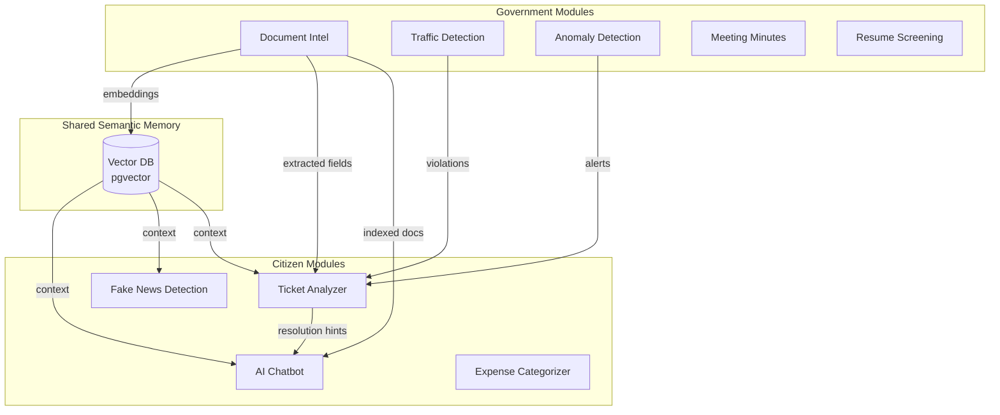

# 🏛️ C.I.T.A.D.E.L. — Project Constitution

> **C**ivic **I**ntelligence & **T**ransparency for **A**dministrative **D**ecision-making, **E**vidence & **L**ogistics

---

## 📋 Document Control

| Field | Value |
|-------|-------|
| **Version** | 1.0.0 |
| **Created** | 2026-02-09 |
| **Status** | LOCKED |
| **Project ID** | mkhsdcxvwitndyfqtaqq |

---

## 🎯 North Star

**Equal-weight optimization of:**
1. **Transparency** — Citizen-facing explainability, provenance, fake news detection
2. **Efficiency** — Automation of documents, tickets, minutes, anomalies
3. **Trust** — Audit trails, evidence bundles, human-in-loop enforcement

---

## 👥 Role Definitions

### Government Roles (RBAC via Supabase Auth)

| Role | Access Level | Permissions |
|------|--------------|-------------|
| `gov_admin` | Full | System config, model access, policy rules |
| `gov_operator` | Standard | Document processing, ticket handling, sensor monitoring |
| `gov_auditor` | Read-Only | Logs, evidence, AI decision review |
| `gov_hr` | Domain | Resume screening, hiring workflows |
| `gov_traffic_officer` | Domain | Violation review, enforcement (HITL) |

### Citizen Roles

| Role | Access Level | Permissions |
|------|--------------|-------------|
| `citizen_public` | Public | Chatbot, fake news detection, info access |
| `citizen_complainant` | Authenticated | Ticket creation & tracking |
| `citizen_applicant` | Authenticated | Application + expense submission |
| `citizen_whistleblower` | Anonymous | Metadata-only submission, no PII stored |

---

## 📊 Unified Data Schemas

### JSON Schema Contracts (Input/Output)

```json
{
  "document": {
    "id": "UUID",
    "uploader_id": "UUID",
    "title": "TEXT",
    "doc_type": "enum:policy|gazette|application|receipt",
    "source_tier": "enum:primary|secondary|demo",
    "raw_text": "TEXT",
    "fields": [{
      "name": "string",
      "type": "string",
      "value": "any",
      "confidence": "float:0-1",
      "source_bbox": "[x,y,w,h]"
    }],
    "embeddings_id": "UUID",
    "pii_masked": "boolean",
    "upload_timestamp": "ISO8601"
  },
  "ticket": {
    "id": "UUID",
    "submitter_id": "UUID",
    "title": "TEXT",
    "text": "TEXT",
    "category": "string",
    "subcategory": "string",
    "priority_score": "float:0-1",
    "confidence": "float:0-1",
    "evidence_refs": ["UUID[]"],
    "status": "enum:open|in_progress|pending_approval|resolved|closed",
    "assigned_to": "UUID",
    "source": "enum:citizen|anomaly_system|traffic_system|manual"
  },
  "ai_decision": {
    "id": "UUID",
    "service_name": "string",
    "model_id": "string",
    "model_version": "semver",
    "input_ref": "UUID",
    "input_hash": "SHA256",
    "output": "JSONB",
    "confidence": "float:0-1",
    "evidence_bundle_ref": "UUID",
    "explanation": "TEXT",
    "requires_human_review": "boolean",
    "human_override_flag": "boolean",
    "human_decision": "enum:approved|rejected|modified|null"
  },
  "sensor_reading": {
    "sensor_id": "string",
    "ts": "ISO8601",
    "sensor_type": "enum:traffic|aqi|fire|smoke|noise",
    "metric_name": "string",
    "value": "float",
    "unit": "string",
    "location": {"lat": "float", "lng": "float", "zone_id": "string"},
    "anomaly_score": "float:0-1",
    "anomaly_detected": "boolean"
  },
  "chat_session": {
    "session_id": "UUID",
    "user_id": "UUID",
    "session_type": "enum:rag|support|fake_news",
    "messages": [{
      "role": "enum:user|assistant",
      "content": "TEXT",
      "timestamp": "ISO8601",
      "sources": ["UUID[]"]
    }],
    "vector_index_refs": ["UUID[]"]
  },
  "vector_entry": {
    "id": "UUID",
    "embedding": "vector(768)",
    "source_ref": "UUID",
    "doc_id": "UUID",
    "page": "integer",
    "bbox": "[x,y,w,h]",
    "chunk_text": "TEXT"
  },
  "resume": {
    "id": "UUID",
    "candidate_id": "UUID",
    "raw_text": "TEXT",
    "skills": "str[]",
    "experience_years": "float",
    "embedding_id": "UUID",
    "upload_timestamp": "ISO8601"
  },
  "resume_match": {
    "id": "UUID",
    "resume_id": "UUID",
    "job_id": "UUID",
    "match_score": "float:0-1",
    "missing_skills": "str[]",
    "confidence": "float:0-1"
  },
  "job": {
    "id": "UUID",
    "title": "TEXT",
    "department": "string",
    "required_skills": "str[]",
    "preferred_skills": "str[]",
    "experience_min": "float",
    "embedding_id": "UUID"
  },
  "meeting": {
    "id": "UUID",
    "audio_ref": "UUID",
    "transcript": "TEXT",
    "summary": "TEXT",
    "action_items": [{"task": "str", "owner": "str", "due": "date"}],
    "confidence": "float:0-1",
    "created_at": "ISO8601"
  },
  "expense": {
    "id": "UUID",
    "department": "string",
    "amount": "float",
    "category": "string",
    "description": "TEXT",
    "timestamp": "ISO8601",
    "anomaly_score": "float:0-1",
    "is_anomaly": "boolean"
  }
}
```

---

### 1. Documents Schema

```sql
documents (
  id UUID PRIMARY KEY DEFAULT gen_random_uuid(),
  uploader_id UUID NOT NULL REFERENCES auth.users(id),
  title TEXT NOT NULL,
  doc_type TEXT NOT NULL CHECK (doc_type IN ('policy', 'gazette', 'application', 'receipt')),
  source_tier TEXT NOT NULL CHECK (source_tier IN ('primary', 'secondary', 'demo')),
  file_path TEXT,
  raw_text TEXT,
  extracted_fields JSONB, -- {field_name: {value, confidence, evidence_span}}
  pii_detected BOOLEAN DEFAULT false,
  pii_redacted_text TEXT,
  embedding_id UUID, -- FK to vector store
  status TEXT DEFAULT 'pending', -- 'pending', 'processed', 'reviewed', 'archived'
  created_by UUID REFERENCES auth.users(id),
  created_at TIMESTAMPTZ DEFAULT now(),
  updated_at TIMESTAMPTZ DEFAULT now()
)
```

### 2. Tickets Schema

```sql
tickets (
  id UUID PRIMARY KEY,
  title TEXT NOT NULL,
  description TEXT,
  category TEXT NOT NULL, -- 'complaint', 'inquiry', 'report', 'application'
  subcategory TEXT,
  priority TEXT NOT NULL CHECK (priority IN ('low', 'medium', 'high', 'critical')),
  status TEXT DEFAULT 'open', -- 'open', 'in_progress', 'pending_approval', 'resolved', 'closed'
  source TEXT NOT NULL, -- 'citizen', 'anomaly_system', 'traffic_system', 'manual'
  source_ref_id UUID, -- Reference to originating system record
  assigned_to UUID REFERENCES auth.users(id),
  resolution_hint TEXT, -- AI-generated suggestion
  resolution_confidence FLOAT,
  resolved_by UUID REFERENCES auth.users(id),
  resolved_at TIMESTAMPTZ,
  created_by UUID REFERENCES auth.users(id),
  created_at TIMESTAMPTZ DEFAULT now(),
  updated_at TIMESTAMPTZ DEFAULT now()
)
```

### 3. AI Decisions Schema (AUDIT LOG)

```sql
ai_decisions (
  id UUID PRIMARY KEY,
  model_name TEXT NOT NULL,
  model_version TEXT NOT NULL,
  module TEXT NOT NULL, -- 'document_intel', 'rag', 'ticket_analyzer', 'traffic', 'anomaly'
  input_hash TEXT NOT NULL, -- SHA256 of input for reproducibility
  input_summary TEXT, -- Human-readable input description
  output JSONB NOT NULL,
  confidence FLOAT NOT NULL CHECK (confidence >= 0 AND confidence <= 1),
  evidence JSONB, -- [{source, excerpt, relevance_score}]
  explanation TEXT, -- Human-readable reasoning
  requires_human_review BOOLEAN DEFAULT false,
  human_reviewed BOOLEAN DEFAULT false,
  human_reviewer_id UUID REFERENCES auth.users(id),
  human_decision TEXT, -- 'approved', 'rejected', 'modified'
  human_notes TEXT,
  reviewed_at TIMESTAMPTZ,
  created_at TIMESTAMPTZ DEFAULT now()
)
```

### 4. Sensors Schema

```sql
sensor_readings (
  id UUID PRIMARY KEY,
  sensor_id TEXT NOT NULL,
  sensor_type TEXT NOT NULL, -- 'traffic', 'aqi', 'fire', 'smoke', 'noise'
  location JSONB, -- {lat, lng, zone_id, zone_name}
  value FLOAT NOT NULL,
  unit TEXT NOT NULL,
  threshold_breach BOOLEAN DEFAULT false,
  anomaly_score FLOAT,
  anomaly_detected BOOLEAN DEFAULT false,
  created_at TIMESTAMPTZ DEFAULT now()
)
```

### 5. Users Extended Profile

```sql
user_profiles (
  id UUID PRIMARY KEY REFERENCES auth.users(id),
  role TEXT NOT NULL,
  department TEXT,
  is_government BOOLEAN DEFAULT false,
  anonymity_mode BOOLEAN DEFAULT false, -- For whistleblowers
  preferences JSONB DEFAULT '{}',
  created_at TIMESTAMPTZ DEFAULT now(),
  updated_at TIMESTAMPTZ DEFAULT now()
)
```

### 6. Chat Sessions (RAG)

```sql
chat_sessions (
  id UUID PRIMARY KEY,
  user_id UUID REFERENCES auth.users(id),
  session_type TEXT DEFAULT 'rag', -- 'rag', 'support', 'fake_news'
  messages JSONB DEFAULT '[]', -- [{role, content, timestamp, sources}]
  context_documents UUID[], -- Array of document IDs used
  created_at TIMESTAMPTZ DEFAULT now(),
  updated_at TIMESTAMPTZ DEFAULT now()
)
```

### 7. Resumes & Job Matching (HR)

```sql
resumes (
  id UUID PRIMARY KEY DEFAULT gen_random_uuid(),
  candidate_id UUID,
  raw_text TEXT,
  skills TEXT[],
  experience_years FLOAT,
  embedding_id UUID,
  created_at TIMESTAMPTZ DEFAULT now()
);

jobs (
  id UUID PRIMARY KEY DEFAULT gen_random_uuid(),
  title TEXT NOT NULL,
  department TEXT,
  required_skills TEXT[],
  preferred_skills TEXT[],
  experience_min FLOAT,
  embedding_id UUID,
  created_at TIMESTAMPTZ DEFAULT now()
);

resume_matches (
  id UUID PRIMARY KEY DEFAULT gen_random_uuid(),
  resume_id UUID REFERENCES resumes(id),
  job_id UUID REFERENCES jobs(id),
  match_score FLOAT CHECK (match_score >= 0 AND match_score <= 1),
  missing_skills TEXT[],
  confidence FLOAT,
  created_at TIMESTAMPTZ DEFAULT now()
);
```

### 8. Meetings & Action Items

```sql
meetings (
  id UUID PRIMARY KEY DEFAULT gen_random_uuid(),
  audio_ref UUID,
  transcript TEXT,
  summary TEXT,
  confidence FLOAT,
  created_by UUID REFERENCES auth.users(id),
  created_at TIMESTAMPTZ DEFAULT now()
);

action_items (
  id UUID PRIMARY KEY DEFAULT gen_random_uuid(),
  meeting_id UUID REFERENCES meetings(id),
  task TEXT NOT NULL,
  owner TEXT,
  due_date DATE,
  ticket_id UUID REFERENCES tickets(id), -- Auto-created ticket
  created_at TIMESTAMPTZ DEFAULT now()
);
```

### 9. Expenses (Gov Transparency)

```sql
expenses (
  id UUID PRIMARY KEY DEFAULT gen_random_uuid(),
  department TEXT NOT NULL,
  amount FLOAT NOT NULL,
  category TEXT,
  description TEXT,
  timestamp TIMESTAMPTZ DEFAULT now(),
  anomaly_score FLOAT,
  is_anomaly BOOLEAN DEFAULT false,
  created_at TIMESTAMPTZ DEFAULT now()
);

expense_summaries (
  id UUID PRIMARY KEY DEFAULT gen_random_uuid(),
  department TEXT NOT NULL,
  period_start DATE NOT NULL,
  period_end DATE NOT NULL,
  total_amount FLOAT,
  by_category JSONB, -- {category: amount}
  anomaly_count INTEGER DEFAULT 0,
  created_at TIMESTAMPTZ DEFAULT now()
);
```

---

## 🤖 Model Registry & Rules

### Registered Models

| Model ID | Module | Purpose | Version | MCP Registered |
|----------|--------|---------|---------|----------------|
| `doc-ocr-v1` | Document Intel | OCR + Layout | 1.0.0 | ✅ |
| `doc-extract-v1` | Document Intel | Field Extraction | 1.0.0 | ✅ |
| `pii-detect-v1` | Document Intel | PII Detection | 1.0.0 | ✅ |
| `rag-embed-v1` | All Services | Document Embedding (Shared) | 1.0.0 | ✅ |
| `rag-answer-v1` | RAG/Meeting | Answer/Summary Generation (Shared) | 1.0.0 | ✅ |
| `ticket-classify-v1` | Ticket Analyzer | Intent Classification | 1.0.0 | ✅ |
| `ticket-priority-v1` | Ticket Analyzer | Priority Prediction | 1.0.0 | ✅ |
| `claim-extract-v1` | Fake News | Claim Extraction | 1.0.0 | ✅ |
| `credibility-v1` | Fake News | Credibility Scoring | 1.0.0 | ✅ |
| `skills-extract-v1` | Resume Screening | Skills Extraction | 1.0.0 | ✅ |
| `whisper-small-v1` | Meeting Minutes | ASR Transcription | 1.0.0 | ✅ |
| `expense-cat-v1` | Expense Categorizer | Category Classification | 1.0.0 | ✅ |
| `anomaly-forest-v1` | Anomaly Detection | Isolation Forest | 1.0.0 | ✅ |

> **Context Sharing:** `rag-embed-v1` and `rag-answer-v1` are shared across all services for embeddings and generation.

### Model Interaction Rules

1. **Context Sharing**: All models read from shared Vector DB (Supabase pgvector)
2. **Logging**: Every inference logged to `ai_decisions` table
3. **Confidence Threshold**: Decisions with confidence < 0.7 → `requires_human_review = true`
4. **Evidence Mandatory**: No output without provenance/evidence
5. **Version Lock**: Production uses pinned versions only

---

## 🔒 Row Level Security (RLS) Policies

### Explicit SQL Predicates per Role

```sql
-- DOCUMENTS TABLE
CREATE POLICY "gov_admin_documents" ON documents
  FOR ALL TO gov_admin USING (true);

CREATE POLICY "gov_operator_documents" ON documents
  FOR ALL TO gov_operator
  USING ((SELECT department FROM user_profiles WHERE id = auth.uid()) = department);

CREATE POLICY "gov_auditor_documents" ON documents
  FOR SELECT TO gov_auditor USING (true);

CREATE POLICY "citizen_documents" ON documents
  FOR SELECT TO authenticated
  USING (uploader_id = auth.uid() OR source_tier = 'primary');

-- TICKETS TABLE
CREATE POLICY "gov_admin_tickets" ON tickets
  FOR ALL TO gov_admin USING (true);

CREATE POLICY "gov_operator_tickets" ON tickets
  FOR ALL TO gov_operator
  USING (assigned_to = auth.uid() OR assigned_to IS NULL);

CREATE POLICY "gov_auditor_tickets" ON tickets
  FOR SELECT TO gov_auditor USING (true);

CREATE POLICY "citizen_tickets" ON tickets
  FOR ALL TO authenticated
  USING (submitter_id = auth.uid())
  WITH CHECK (submitter_id = auth.uid());

-- AI_DECISIONS TABLE (APPEND-ONLY)
CREATE POLICY "ai_decisions_insert" ON ai_decisions
  FOR INSERT TO authenticated WITH CHECK (true);

CREATE POLICY "ai_decisions_select_gov" ON ai_decisions
  FOR SELECT TO gov_admin, gov_auditor USING (true);

CREATE POLICY "ai_decisions_no_delete" ON ai_decisions
  FOR DELETE USING (false);  -- Immutable audit log

-- AUDIT_LOGS TABLE (IMMUTABLE)
CREATE POLICY "audit_logs_read_only" ON audit_logs
  FOR SELECT TO gov_auditor USING (true);

CREATE POLICY "audit_logs_append" ON audit_logs
  FOR INSERT TO authenticated WITH CHECK (true);
```

---

## 🔒 Governance Invariants

### Privacy Rules

| Rule ID | Description | Enforcement |
|---------|-------------|-------------|
| `PRI-001` | PII auto-detected in all documents | Pre-processing pipeline |
| `PRI-002` | PII redacted before RAG indexing | Mandatory transformation |
| `PRI-003` | Whistleblower submissions store NO user_id | Schema constraint |
| `PRI-004` | Anonymity mode prevents activity logging | Application logic |

### Audit Rules

| Rule ID | Description | Enforcement |
|---------|-------------|-------------|
| `AUD-001` | All AI decisions logged with full context | Database trigger |
| `AUD-002` | Human overrides captured with justification | Required field |
| `AUD-003` | No deletion of audit records | RLS + no DELETE policy |
| `AUD-004` | Evidence bundle exportable per decision | API endpoint |

### Human-in-Loop Rules

| Rule ID | Description | Enforcement |
|---------|-------------|-------------|
| `HIL-001` | Traffic violations require officer approval | Status workflow |
| `HIL-002` | High-priority tickets need supervisor review | Escalation trigger |
| `HIL-003` | Resume rankings reviewable before action | UI gate |
| `HIL-004` | Anomaly alerts confirmed before broadcast | Approval queue |

---

## ⚠️ Failure & Degradation Rules

| Condition | Action |
|-----------|--------|
| OCR confidence < 0.60 | Route to human review queue |
| RAG retrieval < 3 results | Respond "insufficient evidence" |
| LLM generation fails | Fallback to extractive answer only |
| MCP marks model unhealthy | Auto-disable service + log incident |
| Any service timeout > 30s | Return cached response or graceful error |

> **Principle:** No AI decision may block user flow without fallback.

---

## 📊 Confidence Thresholds

| Range | Action | HITL Required |
|-------|--------|---------------|
| < 0.60 | Mandatory human review | ✅ Always |
| 0.60–0.80 | Advisory + user editable | ⚠️ Optional |
| > 0.80 | Auto-accept | ❌ (except enforcement) |

> **Note:** Enforcement actions ALWAYS require HITL regardless of confidence.

---

## 🔄 Active Learning Contract

1. Low-confidence `ai_decisions` queued in `learning_queue` table
2. Human edits become labeled examples (stored in `training_samples`)
3. MCP aggregates labels per model weekly
4. Retraining triggered ONLY by `gov_admin` role
5. New model versions require canary validation (10% traffic, 24h)
6. Rollback automatic if error rate > baseline + 5%

---

## 📏 Baseline Definitions

| Module | Baseline Method | AI Must Beat |
|--------|-----------------|---------------|
| Document Extraction | Regex + rule-based parser | F1 + 15% |
| RAG Retrieval | BM25 keyword search | Recall@3 + 10% |
| RAG Generation | Paragraph return (no synthesis) | BLEU + 20% |
| Ticket Classification | TF-IDF + Logistic Regression | F1 + 10% |

> All AI models must outperform baseline on held-out demo set (20% split).

---

## 🔗 Provenance Rules

Every `ai_decision` MUST reference:
- `source_document_id` — Original input document
- `vector_ids[]` — Retrieved vector chunks used
- `parent_decision_id` — If derived from another AI decision
- `model_version` — Exact model used

**Lineage must be traversable end-to-end** (document → vectors → decision → human override).

---

## 🛡️ Abuse & Rate Control

| Control | Limit |
|---------|-------|
| Citizen API rate limit | 60 req/min per user |
| Anonymous (whistleblower) | 10 req/hour per session |
| MCP model quota | 1000 inferences/hour per model |
| Chat session length | 50 messages max |

> Whistleblower submissions store metadata-only (no user_id, no IP logging).

---

## 🚫 Out of Scope (Hackathon)

| Category | Exclusion |
|----------|-----------|
| **Enforcement** | No real fines, arrests, or legal actions |
| **Data** | No live government data; demo/synthetic only |
| **Biometrics** | No facial recognition or biometric ID |
| **External APIs** | No live SMS/email; payloads mocked |
| **Scale** | Single-region, single-tenant demo |
| **Compliance** | No GDPR/CCPA audit certification |



---

## 📦 Data Trust Tiers

| Tier | Sources | Usage |
|------|---------|-------|
| **Primary** | Government policies, gazettes, official rules | RAG ground truth, enforcement context |
| **Secondary** | Sensor data, citizen submissions | Processing, alerts, tickets |
| **Demo** | Kaggle, synthetic, public datasets | Hackathon demonstration (labeled) |

---

## ✅ Schema Approval

> **This constitution is now LOCKED.**
> 
> All modules, tools, and pipelines MUST conform to these schemas.
> Any deviation requires explicit amendment with version bump.

**Approved by**: System Architect
**Approval Date**: 2026-02-09
**Next Review**: Post-hackathon

---
