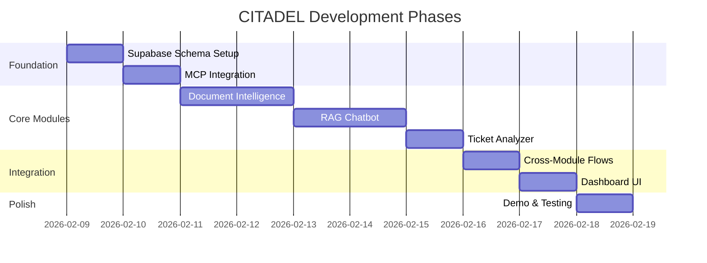

# 🗓️ C.I.T.A.D.E.L. — Task Plan

## Phase Overview

---

## Phase 1: Foundation

### 1.1 Supabase Schema Setup
- [ ] Create all tables per gemini.md schemas
- [ ] Set up Row Level Security (RLS) policies
- [ ] Configure auth roles (gov_*, citizen_*)
- [ ] Enable pgvector extension for embeddings
- [ ] Create audit log triggers

### 1.2 MCP Integration
- [ ] Verify MCP server connectivity
- [ ] Register model versions
- [ ] Set up inference logging pipeline
- [ ] Test audit trail flow

---

## Phase 2: Core Modules (Priority Demo)

### 2.1 Document Intelligence 🔷
**Dependencies**: Supabase ready, pgvector enabled

- [ ] Implement OCR pipeline (Tesseract/Vision API)
- [ ] Build field extraction with confidence scoring
- [ ] Add PII detection & redaction
- [ ] Create embedding generation for Vector DB
- [ ] Log all outputs to ai_decisions

**Demo Checkpoint**: Process 3 sample documents, show extracted fields with confidence

### 2.2 RAG Chatbot 🔷
**Dependencies**: Document Intelligence complete, Vector DB populated

- [ ] Set up retrieval pipeline from pgvector
- [ ] Implement answer generation with citations
- [ ] Add hallucination control (grounding check)
- [ ] Build chat session persistence
- [ ] Create citizen-facing UI

**Demo Checkpoint**: Answer 5 questions with source citations

### 2.3 Ticket Analyzer 🔷
**Dependencies**: Documents & RAG ready for context

- [ ] Build intent classification model
- [ ] Implement priority prediction
- [ ] Create resolution hint generator
- [ ] Connect to anomaly/traffic alert inputs
- [ ] Add human review queue

**Demo Checkpoint**: Process 5 tickets, show classification + priority + hints

---

## Phase 3: Secondary Modules (If Time Permits)

### 3.1 Traffic Violation Detection
- [ ] Integrate vision model for detection
- [ ] Build evidence bundle generator
- [ ] Connect to ticket system
- [ ] Add officer HITL approval flow

### 3.2 Anomaly Detection
- [ ] Implement time-series anomaly detection
- [ ] Create alert generation pipeline
- [ ] Connect alerts to ticket system

### 3.3 Meeting Minutes Generator
- [ ] Set up ASR pipeline
- [ ] Implement action item extraction
- [ ] Auto-generate tickets from action items

---

## Phase 4: Integration & UI

### 4.1 Cross-Module Flows
- [ ] Document → RAG context flow
- [ ] Anomaly → Ticket flow
- [ ] Traffic → Ticket flow
- [ ] End-to-end audit trail verification

### 4.2 Dashboard UI
- [ ] Government operator dashboard
- [ ] Citizen portal (chatbot + ticket tracking)
- [ ] Auditor view (decision logs + evidence)
- [ ] Explainability components (confidence, sources)

---

## Phase 5: Demo & Validation

### 5.1 Required Demonstrations
- [ ] **Flow 1**: Document upload → OCR → Field extraction → RAG indexing → Citizen query
- [ ] **Flow 2**: Anomaly alert → Auto-ticket → Operator review → Resolution
- [ ] **Flow 3**: Citizen complaint → Classification → Priority → Human approval

### 5.2 Human-in-Loop Showcase
- [ ] Officer approves/rejects traffic violation
- [ ] Operator modifies AI ticket classification
- [ ] Admin reviews audit trail

### 5.3 Audit Trail Verification
- [ ] Export evidence bundle for single decision
- [ ] Show full provenance chain
- [ ] Demonstrate no-deletion policy

---

## Completion Criteria

A module is **COMPLETE** when:
- ✅ Output logged to `ai_decisions`
- ✅ Evidence/provenance visible
- ✅ Confidence score displayed
- ✅ Human override option available
- ✅ Cross-module context consumed (where applicable)

---

## Risk Mitigation

| Risk | Mitigation |
|------|------------|
| Dataset delays | Use Kaggle/synthetic immediately |
| Model complexity | Start with simple heuristics, upgrade later |
| Time constraints | Priority modules first, secondary optional |
| Integration issues | Test cross-module flows early |

---
